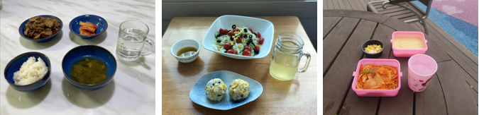
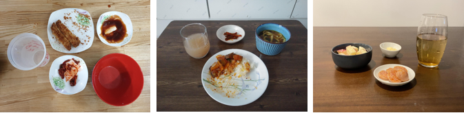

# Service Context Understanding Dataset
> 본 데이터셋은 [Cloud Robot 과제](https://aai4r.github.io)의 일환으로 수집함.
> 식당에서 식사하는 사람들에게 필요한 서비스를 제공하기위한 인공지능 모델을 만들고 테스트하기 위한 데이터셋(이미지와 관련 정보(음식 위치, 남은 양, 식사 진행 상태))을 수집함.

## 수집과정
* 크라우드소싱 방법을 이용하여 식사 전, 중, 후의 식탁 위 이미지를 수집.
* 촬영시 3가지 각도(90도, 45도, 10도), 3가지 장소(실내, 창가, 실외) 중 선택하여 촬영.
* 이미지는 최소 1024x768 픽셀이며, 식탁에는 최소 4개의 메뉴가 존재함.

## 수집 유형 및 규모
* 총 10,064장 이미지와 annotation 정보
* annotation 정보 (음식의 위치/종류, 남은 음식의 양(0~100), 식사 진행 상태(식사 전/식사 중/식사 후), 촬영 각도/위치)

|  |
|:--:|
| *촬영 장소 실내, 창가, 실외의 예* |

|  |
|:--:|
| *촬영 각도 90도, 45도, 10도의 예* |

## 디렉토리 구조
* PASCAL VOC 데이터셋의 구조를 따름

## 다운로드 방법
* [담당자](yochin@etri.re.kr)에게 메일을 보내 요청

## Acknowledgements
> This work was supported by the Institute of Information & communications Technology Planning & Evaluation(IITP) grant funded by the Korea government(MSIT) (No.2020-0-00842, Development of Cloud Robot Intelligence for Continual Adaptation to User Reactions in Real Service Environments)
